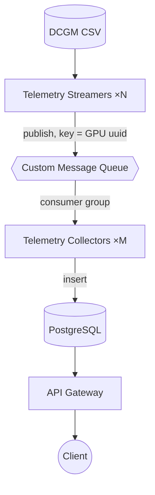
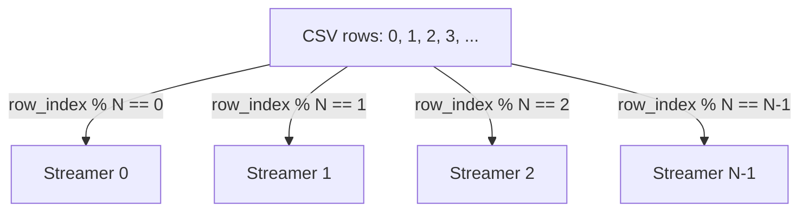
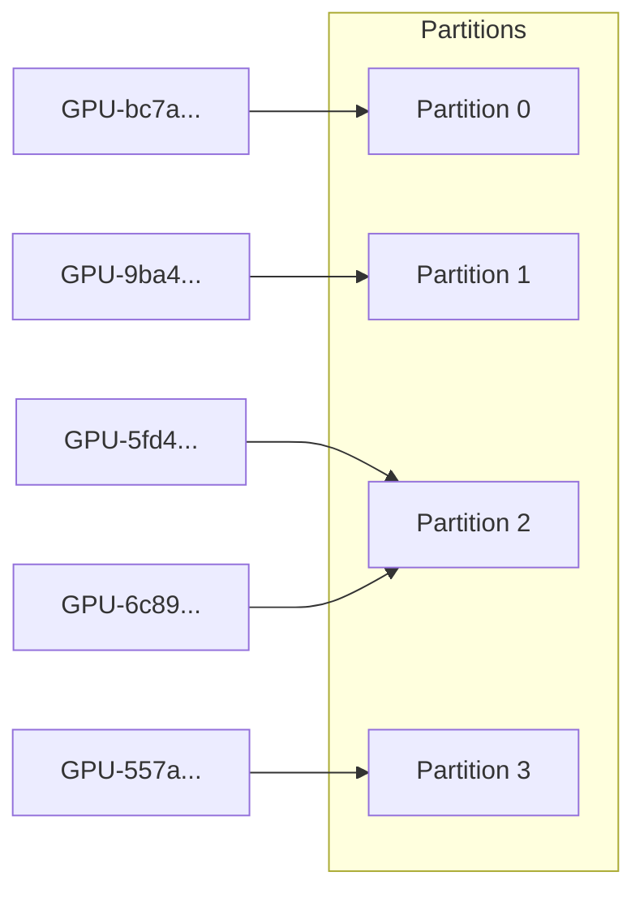
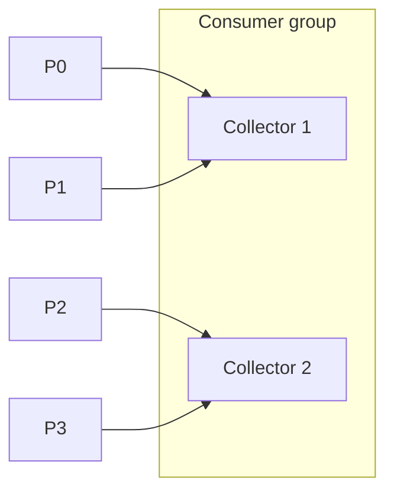
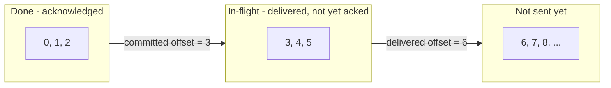
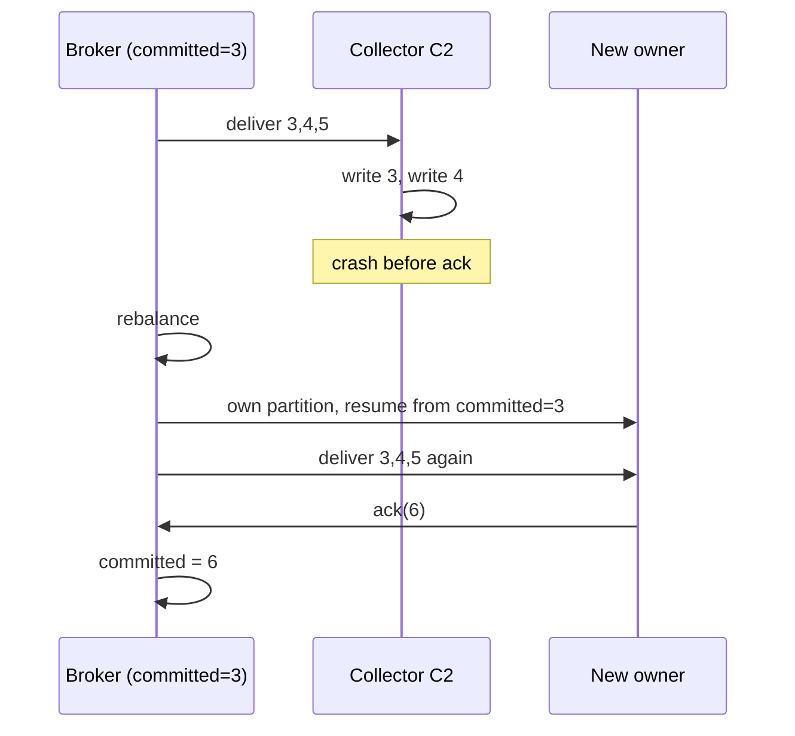
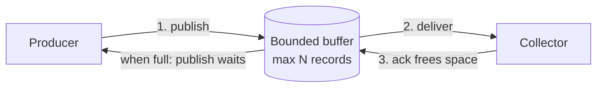

# Elastic GPU Telemetry Pipeline — Design Document

## 1. Introduction

Modern AI infrastructure consists of clusters of many hosts, each equipped with one
or more GPUs. These GPUs continuously emit operational telemetry such as
utilization, temperature, power consumption, memory usage, and clock frequencies.
This telemetry is critical for cluster operators, who use it to answer questions
such as which GPUs are active, which are underutilized, whether a GPU is approaching
its thermal limit, and how a GPU has behaved over a given period.

At cluster scale, telemetry becomes a high-volume, continuous stream that must be
collected, transported, persisted, and queried efficiently. This document describes
the design of an elastic GPU telemetry pipeline that ingests, processes, and exposes
this data in a cloud-native environment.

The design rests on two principles: producers and consumers must scale
independently, and ingestion must continue even when downstream systems temporarily
slow down. To achieve both, the system introduces a custom message queue that
buffers telemetry between producers and consumers.

## 2. Problem Statement

Telemetry generation and telemetry processing operate at fundamentally different
speeds. Producers generate events continuously and at relatively predictable rates,
whereas consumers may slow down due to database latency, maintenance operations, or
transient failures. Without an intermediate buffering layer, producers become
tightly coupled to consumers, and a slowdown or failure in one subsystem propagates
through the entire pipeline.

The system therefore requires decoupling between producers and consumers, elastic
horizontal scaling on both tiers, reliable delivery of telemetry, and efficient
querying of historical data.

## 3. Architecture

The system consists of five independently deployable services: the Telemetry
Streamer, the Message Queue, the Telemetry Collector, the Database, and the API
Gateway. Telemetry flows through them in a single direction, with the API Gateway
attached to the read side of the database.



The design is shaped by two deliberate decoupling points:

* **The message queue** sits between producers and consumers. Producers publish
  without waiting for consumers, so if collectors slow down, the queue absorbs the
  difference instead of the pressure flowing back to the streamers.
* **The database** sits between the write path (collectors inserting) and the read
  path (the API reading). A burst of queries cannot slow ingestion, and heavy
  ingestion cannot stall queries.

Because of these two boundaries, no component can directly overload another, which is
what allows every component to scale on its own. Each service is a separate process
with its own container image and Helm chart, so it starts, scales, and fails
independently. The sections that follow describe each component in turn.

## 4. Telemetry Streamer

The Telemetry Streamer is the entry point of the pipeline. It simulates GPU telemetry
generation by reading NVIDIA DCGM records from the provided CSV file, where each row
is an independent telemetry sample, and publishing each row to the message queue.
Because the source dataset is finite while real telemetry is continuous, the dataset
is replayed in a loop to simulate an endless stream. The timestamp associated with a
sample is not the value stored in the CSV file but the time at which the sample is
processed by the pipeline.

Each row is published with the GPU `uuid` as its message key, which the message queue
uses to place the row on a partition (see Section 5.1).

**Responsibilities.** Read telemetry rows from the CSV source, transform them into
structured telemetry events, publish those events to the message queue keyed by GPU
uuid, and repeat indefinitely.

### 4.1 Scaling and Sharding

Streamers scale horizontally as multiple replicas. Because the consuming side uses a
consumer group to divide work, but the producing side has no equivalent broker-managed
coordination, streamers must avoid publishing the same rows themselves. The workload
is therefore partitioned deterministically by replica: each replica publishes only the
rows whose index satisfies

```text
row_index % replica_count == ordinal
```

where `replica_count` is the number of replicas and `ordinal` is a replica's stable
index (0, 1, 2, …). In Kubernetes the streamer runs as a StatefulSet, which gives each
pod exactly that fixed ordinal. Each replica therefore publishes every Nth row —
replica *i* takes the rows whose index leaves remainder *i*. With two replicas this is
just the even/odd split; with N replicas each takes a disjoint 1/N share, and together
they cover every row exactly once.



Changing the replica count just changes the divisor — no coordination between replicas
is needed. Rescaling does shift the mapping: a given row index maps to a different
replica before and after the change, so around a rescale some rows are published by a
different streamer. This is harmless here — the CSV is replayed indefinitely and each
sample's timestamp is assigned at ingestion rather than read from the CSV, so every
pass is simply fresh telemetry rather than duplicated history.

**Known boundary — scale streamers via Helm, not `kubectl scale`.** A streamer's shard
depends on `REPLICAS`, an env value fixed at install time. `kubectl scale` adds pods
without updating it, so a new pod inherits a stale count and owns no rows
(`idx % REPLICAS == ordinal` never matches its ordinal) — it runs but publishes nothing.
Scale streamers with Helm (`--set replicaCount=N`), which updates `REPLICAS` and
restarts the pods to re-shard. Collectors have no such limit: the broker assigns their
work at runtime, so `kubectl scale` rebalances them immediately. Letting the streamer
read its replica count at runtime would remove this boundary (Section 11).

## 5. Message Queue

The message queue is the core of the system. Its responsibility is to decouple
telemetry production from consumption while maintaining throughput and reliability. It
is implemented as a standalone service rather than a shared library, so it can be
deployed, upgraded, monitored, and scaled independently of the applications that use
it.

**Transport.** Streamers and collectors talk to the broker over a **custom TCP
protocol**, not HTTP or gRPC. Each message is a length-prefixed binary frame: a 4-byte
length, a 1-byte opcode (publish, subscribe, poll, acknowledge, heartbeat), and a JSON
payload. TCP was chosen deliberately — the exercise calls for a genuinely custom queue,
and long-lived connections suit the continuous, bidirectional flow of frames
(deliveries out, acks back) with low per-message overhead; the length prefix makes
framing unambiguous and JSON keeps it easy to debug. The client SDK
(`messagequeue/client`) hides the wire format behind a small Publish/Subscribe/Poll/Ack
API.

### 5.1 Partitioning

A single ordered queue can be consumed by only one worker at a time, so it cannot
scale. The queue therefore splits its messages across a fixed number of
**partitions**, each an independent ordered log. With N partitions, up to N collectors
consume in parallel while order is preserved within each partition.

A message's partition is derived from its key, the GPU `uuid`:

```text
partition = hash(uuid) % partition_count
```

The hash turns the uuid into a large integer; the modulo folds it into a valid index
(`0..N-1`).



_Placements are illustrative, not actual hash outputs; the point is that each GPU maps
to one partition and a partition may hold several GPUs (here P2 holds two)._

* **Deterministic** — the same uuid always maps to the same partition, so a GPU's
  telemetry stays on one partition and is consumed in order.
* **Well distributed** — different uuids spread evenly, balancing load.

A partition holds many GPUs, but a single GPU never spans partitions — giving ordering
per GPU and parallelism across GPUs at the same time.

### 5.2 Consumer Groups and Rebalancing

Collectors cooperating on a topic form a **consumer group**. One rule governs it: each
partition is owned by exactly one collector at a time (never shared), which preserves
per-GPU ordering.



When a collector joins or leaves, the broker **rebalances** — it recomputes the
assignment and redistributes partitions. Adding one raises throughput; removing or
losing one reassigns its partitions to the survivors. This makes the consuming tier
elastic.

Because a partition cannot be shared, the partition count caps consumer parallelism:

| Partitions | Collectors | Result |
|---|---|---|
| 4 | 2 | 2 partitions each |
| 4 | 4 | 1 partition each |
| 4 | 5 | one collector idle |

The system runs **16 partitions for up to 10 collectors**. Sixteen comfortably exceeds
the expected collector ceiling (10), so every collector owns at least one partition
with room to spare — load stays balanced and collectors can scale further without
repartitioning — while the count is small enough to keep partition management simple.
Because the partition count is fixed for a topic's life, it is set above the
anticipated ceiling rather than tuned to the current replica count.

### 5.3 Delivery and Reliability

The queue guarantees **at-least-once delivery**: nothing is lost, but a record may
occasionally be processed more than once.

Each partition tracks two bookmarks per group. The **committed offset** marks
"everything below here is processed and acknowledged" and advances only when a
collector acknowledges. The **delivered offset** marks how far the broker has handed
records out. The gap between them is the in-flight records — delivered but not yet
acknowledged.



The committed and delivered offsets are the two dividing lines: everything left of
**committed** is done, everything between the two is in flight, and everything right of
**delivered** has not been sent yet.

The order of operations is deliberate — **persist to the database first, acknowledge
after** — so a crash can only cause reprocessing, never loss.



On failover the new owner resumes from the committed offset: unprocessed records get
processed (nothing lost) and already-written ones repeat (duplicates). Duplicates are
neutralized by the unique constraint on `(uuid, metric, ts)`.

**At-least-once delivery + idempotent writes = exactly-once results in storage**,
without the coordination cost of true exactly-once delivery.

### 5.4 Backpressure

Each partition has bounded capacity and retains records only until they are
acknowledged. When a partition's buffer is full, further publishes to it block until
consumers catch up and space is reclaimed.



Because a full buffer slows producers rather than growing without bound, a slow or
absent consumer cannot exhaust broker memory, which protects stability during traffic
spikes.

### 5.5 Broker Failure Semantics

The broker is intentionally **in-memory**: partitions, offsets, and buffered records
live only in the broker process's memory and are not persisted to disk. This keeps the
implementation simple and delivery latency low, but it has a direct consequence — if
the broker restarts or crashes, any telemetry that is still buffered in memory and has
not yet been consumed and acknowledged is lost. Committed offsets are likewise held in
memory, so a restarted broker begins from an empty state.

This tradeoff is acceptable here. The streamers regenerate telemetry continuously (the
CSV is replayed indefinitely), so the pipeline refills with current data within moments
of a restart, and GPU telemetry tolerates occasional gaps — the operational picture
comes from continuous trends, not any single sample. The design therefore favors
simplicity and throughput over durable buffering. Section 10 lists this as an explicit
tradeoff, and Section 11 outlines the durability path (a write-ahead log and replicated
brokers) for deployments that cannot tolerate the loss.

## 6. Telemetry Collector

The Telemetry Collector is the consuming tier. It reads telemetry from the queue as a
member of a consumer group, parses each raw DCGM record into a structured sample,
persists it to the database, and then acknowledges it. Collectors are intentionally
stateless; their only responsibility is to turn transient telemetry into durable,
queryable data.

Acknowledgement occurs only after a successful write, which is what upholds the
at-least-once guarantee described in Section 5.3: a crash before the write results in
redelivery rather than data loss. Malformed records are skipped so that a single bad
row cannot stall the stream.

Collectors scale horizontally through Kubernetes replicas within one consumer group;
adding replicas increases ingestion throughput up to the partition-count ceiling
(Section 5.2).

## 7. Database

### 7.1 Workload

The storage layer must support a write-heavy, append-only workload — a continuous
stream of small telemetry samples — alongside two read patterns from the API: listing
all known GPUs, and retrieving the telemetry for a single GPU over a time range,
ordered by time. In short: high-rate inserts and indexed, time-ordered range scans per
GPU.

### 7.2 Choice of Database

PostgreSQL was chosen as the storage engine. The candidates considered and the reasons
for the decision are summarized below.

| Option | Strengths | Why not chosen here |
|---|---|---|
| **PostgreSQL (chosen)** | Mature and ubiquitous; SQL and strong secondary indexing suit the query patterns; supports many concurrent writers (multiple collectors); ACID and a unique constraint give idempotent writes for free; simple to operate on Kubernetes | — |
| TimescaleDB | A PostgreSQL extension adding time-series partitioning and compression | Adds operational surface and is unnecessary at this scale; because it is a Postgres extension, it can be adopted later without a rewrite |
| InfluxDB / Prometheus | Purpose-built for metrics ingestion | Different query model; Prometheus is pull-based with short retention and is unsuited to arbitrary historical queries by GPU identity |
| Cassandra | Excellent write throughput; naturally time-series friendly | Heavy operational footprint and eventual consistency; overkill for a target of ten collectors |
| MongoDB | Flexible schema; easy to start with | Weaker for time-range analytical queries and lacks the relational constraints used for idempotency |
| SQLite | Zero-operations, embedded | Single-writer; cannot serve multiple concurrent collectors, which the design requires |

The deciding factors were fit and simplicity. The access patterns are fundamentally
relational and index-driven, which PostgreSQL serves directly; multiple collectors
must write concurrently, which rules out an embedded single-writer store; and the
unique-constraint mechanism provides the idempotency the delivery design depends on
without additional coordination. Purpose-built time-series systems would add
operational complexity that the target scale (≤10 collectors) does not justify, and
where time-series optimizations later become valuable, TimescaleDB offers an in-place
upgrade path.

### 7.3 Schema

DCGM telemetry is long-format: each row carries a single metric for one GPU at one
instant. Telemetry is therefore stored as generic samples rather than pivoted into
per-metric columns, which keeps the schema faithful to the source and extensible to
new metrics. GPU identity is the globally unique `uuid`; the per-host GPU index is not
unique across hosts.

```sql
gpu_samples (
    ts          TIMESTAMPTZ NOT NULL,
    metric      TEXT NOT NULL,
    value       DOUBLE PRECISION NOT NULL,
    uuid        TEXT NOT NULL,
    gpu_index   TEXT NOT NULL,
    device      TEXT,
    model_name  TEXT,
    hostname    TEXT
)
```

An index on `(uuid, ts)` serves the primary per-GPU, time-ordered query. A unique
constraint on `(uuid, metric, ts)` makes repeated inserts idempotent, which is what
allows the pipeline to rely on at-least-once delivery.

## 8. API Gateway

The API Gateway provides external access to telemetry data. It serves reads
exclusively from PostgreSQL and never communicates with the message queue, so query
traffic cannot interfere with ingestion. It exposes the following endpoints and
generates its OpenAPI specification automatically during the build:

```text
GET /api/v1/gpus
GET /api/v1/gpus/{id}/telemetry
GET /api/v1/gpus/{id}/telemetry?start_time=&end_time=&metric=
```

The gateway also serves the generated spec at `GET /openapi.yaml` and an interactive
**Swagger UI at `GET /docs`**, so the API can be explored and exercised from a browser
without any external tooling.

`GET /api/v1/gpus` lists every GPU for which telemetry exists. `GET
/api/v1/gpus/{id}/telemetry` returns the samples for one GPU (identified by `uuid`) in
chronological order, optionally bounded by `start_time` and `end_time` and filtered to
a single `metric`.

Example response for a telemetry query:

```json
{
  "gpu": "GPU-5fd4f087-86f3-7a43-b711-4771313afc50",
  "count": 2,
  "samples": [
    { "timestamp": "2025-07-18T20:42:34Z", "metric": "DCGM_FI_DEV_GPU_UTIL", "value": 100 },
    { "timestamp": "2025-07-18T20:42:35Z", "metric": "DCGM_FI_DEV_GPU_UTIL", "value": 97 }
  ]
}
```

## 9. Observability

Every service emits structured JSON logs, and the API gateway exposes Kubernetes
health and readiness probes together with a `/metrics` endpoint in Prometheus text
format. Logs carry GPU and outcome identifiers so a sample can be traced from
ingestion to storage. As the system grows, natural signals to surface include
per-partition queue depth, publish and consume rates, consumer lag, and database
write failures.

## 10. Design Tradeoffs

The design makes deliberate tradeoffs, favoring simplicity, low latency, and
independent scaling at the target scale (≤10 streamers/collectors) over the stronger
durability and delivery guarantees a large-scale system would need. The key decisions:

| Decision | Benefit | Tradeoff |
|---|---|---|
| At-least-once delivery | Simple, reliable delivery guarantees | Duplicate processing possible (neutralized by idempotent writes) |
| In-memory queue | Low latency and simple implementation | Broker restart causes loss of buffered, unacknowledged messages |
| Fixed partition count | Simple implementation and predictable scaling | Consumer parallelism capped by the partition count |
| PostgreSQL storage | Mature ecosystem, strong indexing, idempotency via constraints | Less optimized for very large-scale time-series workloads than a specialized TSDB |
| Consumer-group model | Horizontal scaling while preserving per-GPU ordering | Requires partition-ownership and rebalancing logic |
| Custom TCP protocol | Full control, low overhead, a genuinely custom queue | More protocol code to maintain than reusing HTTP/gRPC |

Each tradeoff is reversible without redesigning the system: idempotent writes already
absorb duplicates, TimescaleDB offers an in-place storage upgrade (Section 7.2), and
the durability and partition-scaling items in Section 11 address the queue's limits.

## 11. Future Improvements

* **Broker durability and high availability** — persist the partition logs (for
  example via a write-ahead log) and add replicated brokers with leader election so
  the queue survives a broker restart or failure.
* **Persistent, disk-backed queue storage** for larger backlogs than memory allows.
* **Automatic partition scaling** to grow consumer parallelism beyond the current
  fixed partition count.
* **Dead-letter handling** for records that repeatedly fail to process.
* **Runtime replica discovery for the streamer** — let a streamer read the current
  replica count at runtime (from the Kubernetes API or peer DNS) and re-shard on change,
  so `kubectl scale` alone puts a new producer to work without a Helm re-render (see the
  known boundary in Section 4.1).
* **Data retention and lifecycle management** — the `gpu_samples` table is append-only
  and grows without bound, so a long-running deployment eventually exhausts database
  storage (at which point writes fail and backpressure halts ingestion until space is
  freed). Production deployments would add time-based retention (dropping or archiving
  old partitions), downsampling/rollups of older data, or adopt TimescaleDB (Section
  7.2) for native retention policies and columnar compression, optionally tiering cold
  data to object storage.
* **Authentication, authorization, and TLS** on the API and the broker.
* **Multi-cluster deployment** for cross-region resilience.
